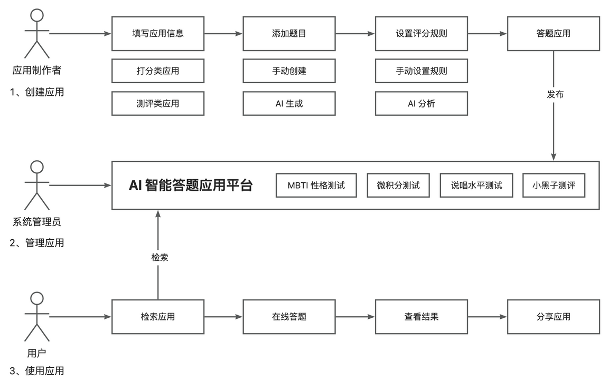

# AITesting：AI答题系统（仅后端部分）

> 作者：[玉圣玲](https://github.com/shenglingyu)
> 日期：2025-03-09


## 项目介绍
基于Spring Boot + Redis + ChatGLM + RxJava + SSE 的 **AI 答题系统**。
用户可以基于 AI 快速制作并发布答题应用，支持检索、分享、在线答题并基于 AI 得到回答总结；管理员可以集中管理和审核应用。

### 环境准备

- JDK11
- Maven 3.9.9
- MYSQL 8.0.41
- Redis 5.0.14

### 主流框架 & 特性

- Spring Boot 
- MyBatis + MyBatis Plus 数据访问（开启分页）
- Spring AOP 切面编程
- Spring 事务注解

### 数据存储

- MySQL 数据库
- Redis 内存数据库
- Caffeine 本地缓存

### 工具类

- Hutool 工具库
- Lombok 注解
- CodeGeex AI编程助手

### 模块

- 用户模块
- 应用模块
- 题目模块
- 答案模块
- 评分模块
- 统计分析模块

### 核心业务流程



### 业务特性

- 全局异常处理器
- 自定义错误码
- 封装通用响应类
- Swagger + Knife4j 接口文档
- 自定义权限注解 + 策略模式
- SSE+RxJava异步流处理
- Caffeine缓存+Redisson分布式锁
- 线程池隔离机制
- 幂等性设计


## 业务功能

- 提供示例 SQL（用户、应用、题目、用户答案、评分结果表）
- 用户登录、注册、注销、更新、检索、权限管理
- 应用创建、删除、编辑、更新、数据库检索
- 支持自定义应用题目、评分策略和AI创建题目、AI评分两种策略
- SSE+RxJava异步流处理，实时返回AI生成题目
- Caffeine缓存+Redisson分布式锁，优化AI评分响应时间
- 雪花算法+数据库主键约束，减少重复提交产生的脏数据
- 支持数据分析，分析热门应用、应用的评分结果分析

### 单元测试

- JUnit5 单元测试
- 示例单元测试类

### 架构设计

- 合理分层

## 项目的使用说明

### MySQL 数据库

1）修改 `application.yml` 的数据库配置为你自己的：

```yml
spring:
  datasource:
    driver-class-name: com.mysql.cj.jdbc.Driver
    url: jdbc:mysql://localhost:3306/yudada
    username: root
    password: 123456
```

2）执行 `sql/create_table.sql` 中的数据库语句，自动创建库表，执行init_data.sql初始化数据库表

3）启动项目，访问 `http://localhost:8101/api/doc.html` 即可打开接口文档，不需要写前端就能在线调试接口了~


### Redis 分布式登录
- 修改 `application.yml` 的 Redis 配置为你自己的：

```yml
spring:
  redis:
    database: 1
    host: localhost
    port: 6379
    timeout: 5000
    password: 123456
```

### 智谱AI接入
#### 实现功能
- 智能生成应用题目
- 智能评分
#### 使用方法
- 登录智谱ai开放平台（https://open.bigmodel.cn/console/overview），获取自己的key
- 修改 `application.yml` 的 ai 配置为你自己的key：

```yml
ai:
  apiKey: XXX
```

